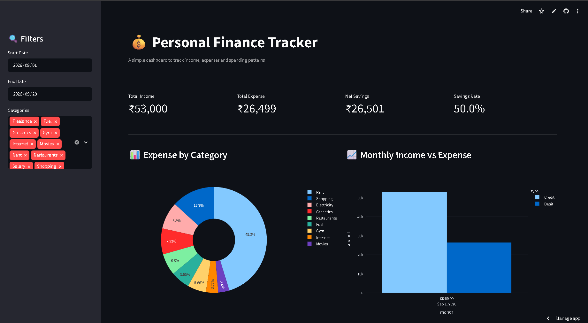
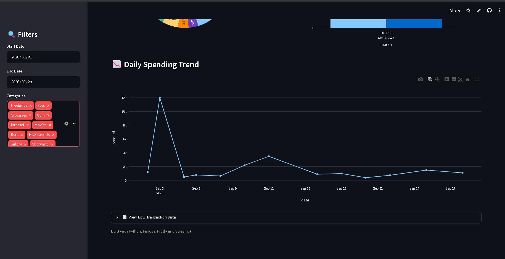

# 💰 Personal Finance Tracker

A Data Analytics Dashboard That Visualizes Income, Expenses And Spending Patterns From Transaction Data — Built With Python, Pandas, Plotly And Streamlit.

🔗 **Live Demo:** https://finance-tracker-mcfsh665cwmsrirkmxmbhx.streamlit.app

## Screenshots





## Features

- 📊 Real-time KPIs — Total income, Expense, Net Savings, Savings rate
- 🥧 Expense Creakdown By Category (Donut Chart)
- 📈 Monthly Income vs Expense Comparison
- 📉 Daily Spending trend Line Chart
- 🔍 Interactive Filters by date range and category
- 📄 Raw Transaction Data View

## Tech Stack

| Tool | Purpose |
|------|---------|
| Python | Core programming Language |
| Pandas | Data Loading, Filtering, Aggregation |
| Plotly | Interactive Charts |
| Streamlit | Dashboard Web App Framework |

## Run Locally

```bash
git clone https://github.com/ABHAYMARWADE2004/finance-tracker.git
cd finance-tracker
pip install -r requirements.txt
streamlit run app.py
```

## Data Format

The app reads a CSV file (`transactions.csv`) with these columns:

| Column | Type | Example |
|--------|------|---------|
| date | YYYY-MM-DD | 2026-09-01 |
| category | Text | Groceries |
| amount | Number | 1200.50 |
| type | Credit / Debit | Debit |

## Future Improvements

- Replace CSV with a Real Database (PostgreSQL)
- Monthly Budget Alerts
- Auto-Categorization Of Transactions
- User Authentication
